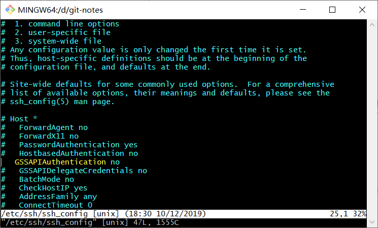

# 【Git】解决SSH访问速度慢的问题

在使用 SSH 方式访问Git服务器时，经常会遇到速度很慢的情况，如果有类似情况，可以尝试本文的解决方式，希望对你有帮助。

## 解决方式

修改 SSH 配置 vim /etc/ssh/ssh_config，修改配置项 GSSAPIAuthentication no 即可解决。

## 操作步骤

以 Windows 10 操作系统为例：

1. 右键点击 "Git Bash here"，打开一个命令行窗口
2. 编辑 ssh_config ： vim /etc/ssh/ssh_config
3. 搜索 GSSAPIAuthentication 找到该配置项
4. 配置禁用 GSSAPI 校验：默认使用 # 号注释掉了，去除行首注释或者新增 GSSAPIAuthentication no，然后保存退出
5. 使用 ssh 方式再次操作 git 项目，速度飞快

参考资料：

1. ssh/git 非常慢的解决办法 ： https://blog.csdn.net/liangpz521/article/details/21527297
2. 关闭 GSSAPIAuthentication选项：http://www.bdkyr.com/xtyw002/2329.html
3. 通过关闭 UseDNS和GSSAPIAuthentication选项加速 SSH登录：https://www.cnblogs.com/wjoyxt/p/3790537.html